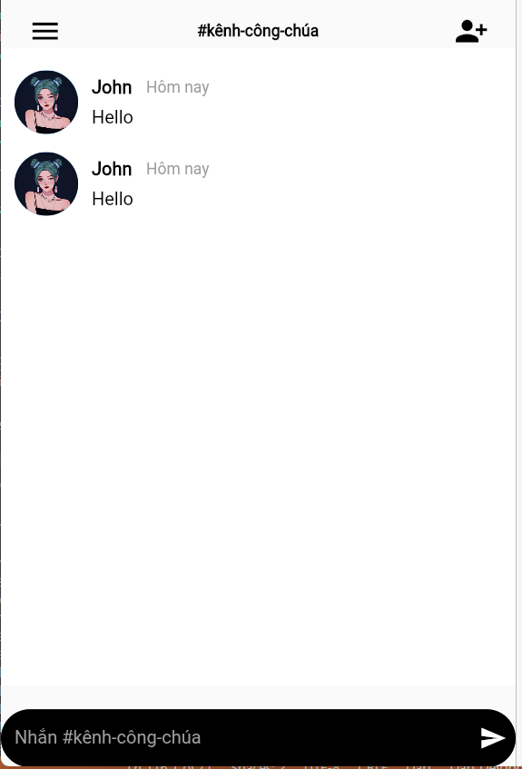
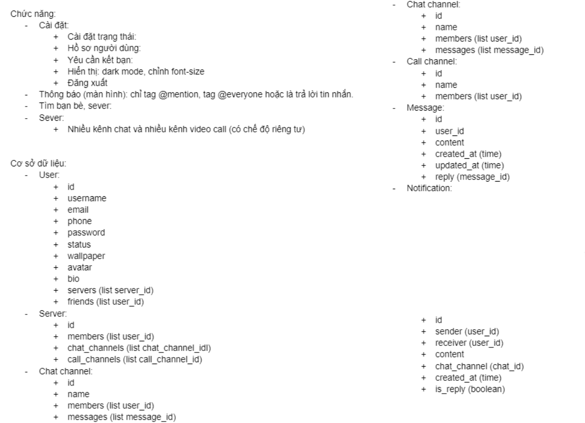
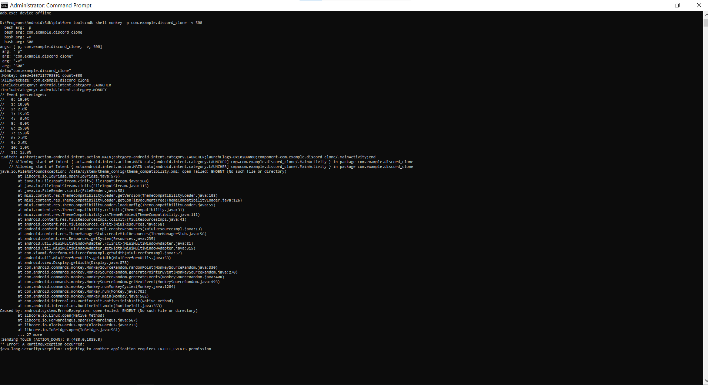

# Nhóm 06 - INT3020 40

# Thành viên

### - Nguyễn Văn Tú - 19021381

### - Bùi Văn Toán - 19021372

### - Nguyễn Mạnh Tuấn - 19021384

# Báo cáo quá trình

# Tuần 02 - Run "Hello World!"

- Cài đặt Flutter và Android Studio, thực hiện code giao diện "hello world!"
- Ảnh chụp màn hình run code, ảnh chụp màn hình điện thoại mô phỏng

 

# Tuần 03 - Làm quen các Flutter widget cơ bản

- TextField
- Checkbox
- Slider
- ToggleButtons
- FloatingActionButton

# Tuần 04 - Triển khai Bài tập lớn Discord Clone

## Các màn hình đã làm

- Welcome screen
- Singin screen
- Chat screen

  

# Tuần 05 - Tiếp tục triển khai Bài tập lớn Discord Clone

## Các màn hình đã làm

- Account screen
- Friend screen
- Channel screen
- Prepare call screen
- Call screen

# Tuần 06 - Thảo luận, trao đổi về cơ sở dữ liệu

Tự học kiến thức về NestJS để làm backend

# Tuần 07 - Nghiên cứu về cơ sở dữ liệu

# Tuần 08 - Kết quả dùng công cụ kiểm thử Monkey & Cải thiện các màn hình giao diện người dùng

- Kết quả dùng công cụ kiểm thử Monkey

- Cải thiện các màn hình giao diện người dùng:
  - Welcome Screen

